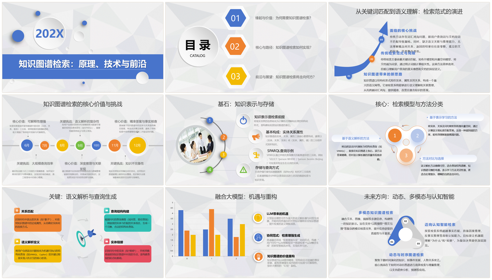
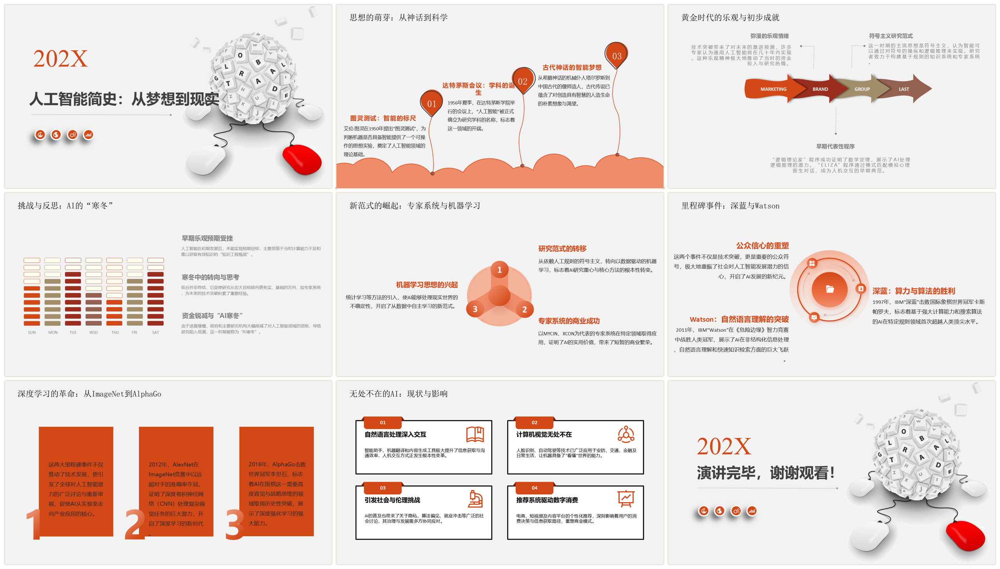
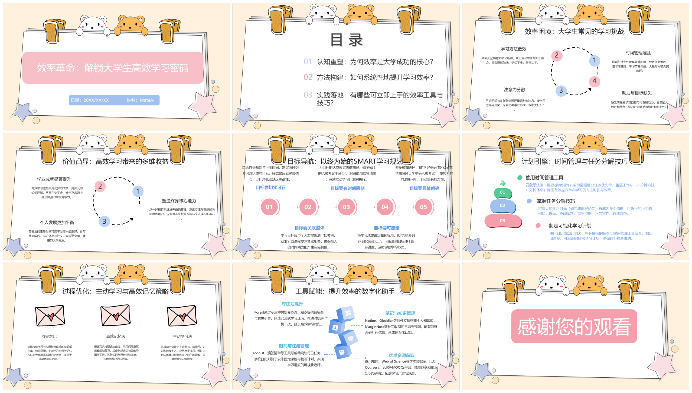
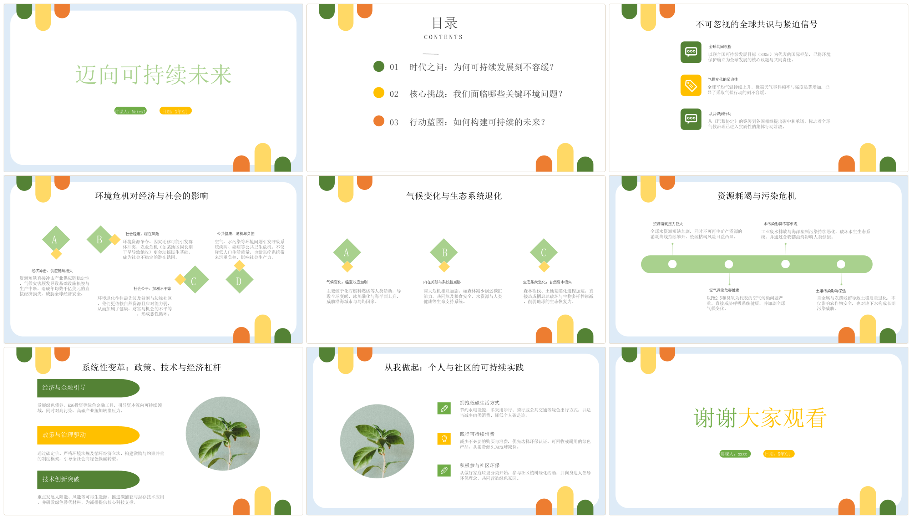

<div align="center">


# MatePPT

一个面向 AI PPT 场景的前端项目，覆盖主题输入、项目创建、模板选择、作品管理，以及经典 PPT 编辑能力。

[](./LICENSE)


[中文](./README.md) | [English](./README_EN.md)

[在线使用](https://mateclaw.github.io/MatePPT/) · [快速开始](#快速开始) · [功能概览](#features) · [协议](./LICENSE)

</div>

---

## 🎬 视频演示

https://github.com/user-attachments/assets/c4a3d9df-6d97-42d7-8c4e-692a0f3813ee

<p align="center">
  整体演示了 AI PPT 从大纲生成到编辑、导出的核心流程。
</p>

## 🌐 在线使用

在线体验地址：[https://mateclaw.github.io/MatePPT/](https://mateclaw.github.io/MatePPT/)

该地址用于快速体验项目的核心流程，包括大纲生成、模板选择、幻灯片编辑和导出能力。

## 🖼️ 成品实例

<table>
  <tr>
    <td align="center" width="50%">
      
      <br />
      <strong>知识图谱检索介绍</strong>
    </td>
    <td align="center" width="50%">
      
      <br />
      <strong>人工智能简史</strong>
    </td>
  </tr>
  <tr>
    <td align="center" width="50%">
      
      <br />
      <strong>大学生高效学习方法</strong>
    </td>
    <td align="center" width="50%">
      
      <br />
      <strong>环境保护与可持续发展</strong>
    </td>
  </tr>
</table>

## 🚀 项目简介

MatePPT 的定位不是单一编辑器内核，而是一套更接近产品前台的 AI PPT Web 应用。

它更适合这些场景：

- AI PPT 生成产品前端
- 带登录、项目管理、模板流转的 Web 应用
- 基于现有编辑器继续扩展业务能力的前端项目

如果你只想要一个极简纯编辑器，或者完全不打算接后端接口，那需要按自己的场景再做裁剪。


<a id="features"></a>

## ✨ 功能概览

### 产品链路

- `主题输入`：输入主题或需求，进入 AI PPT 创建流程
- `项目创建`：发起 PPT 项目并进入后续编辑流程
- `模板选择`：支持模板浏览、选择和套用
- `作品管理`：查看历史项目，继续编辑或预览
- `详情流转`：在大纲、模板、编辑、查看等页面间切换

### 编辑能力

- `经典编辑器`：保留完整的 PPT 编辑主界面
- `页面管理`：支持页面增删、排序、切换
- `元素编辑`：文本、图片、图形、表格、图表、多媒体等
- `样式调整`：主题、配色、布局、基础样式配置
- `导出相关`：保留导出与预览相关能力入口

## 🧱 技术栈

- `React 18`
- `Umi 4`
- `TypeScript`
- `Ant Design`
- `Zustand`
- `React Query`
- `Tailwind CSS`

## ⚡ 快速开始

### 环境要求

- `Node.js >= 20`
- `pnpm >= 10`

### 安装依赖

```bash
corepack pnpm install
```

### 启动开发环境

```bash
corepack pnpm dev
```

默认访问：

```text
http://localhost:8000
```

### 生产构建

```bash
corepack pnpm build
```

## 🔌 后端配置

本项目运行时会请求后端接口。常见接法有两种：

1. 本地开发直接使用 `.umirc.ts` 中的 `proxy`
2. 显式指定后端地址

例如在 PowerShell 中：

```powershell
$env:UMI_API_BASE="http://your-api-host"
corepack pnpm dev
```

如果没有可用后端，页面可以启动，但登录、项目创建、PPT 生成等能力不会正常工作。

## 🗂️ 项目结构

```text
MatePPT/
├─ public/          # 静态资源
├─ src/
│  ├─ pages/        # 页面入口
│  ├─ components/   # 通用组件与业务组件
│  ├─ services/     # 请求服务层
│  ├─ stores/       # 状态管理
│  ├─ ppt/          # PPT 编辑器主体
│  ├─ routes/       # 路由配置
│  └─ config/       # 运行配置
├─ .umirc.ts        # Umi 配置
└─ package.json
```

## 🤝 贡献

欢迎提交 Issue 和 Pull Request。

建议流程：

1. Fork 本仓库
2. 创建功能分支
3. 完成修改并本地验证
4. 提交 Pull Request

提交前建议至少执行一次：

```bash
corepack pnpm build
```

## 📄 开源协议

本项目采用 `AGPL-3.0` 协议开源，具体内容见 [LICENSE](./LICENSE)。
